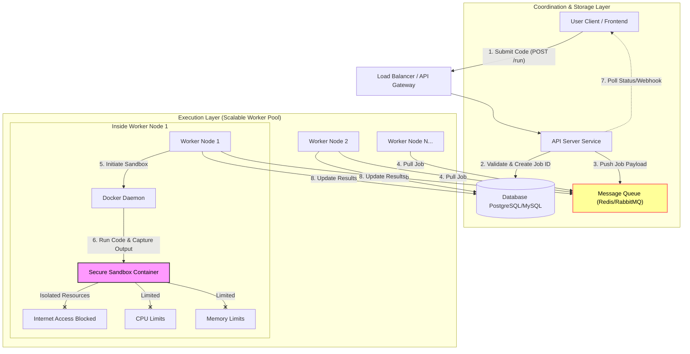

# PCR

```mermaid
graph TD
    Client["User Client / Frontend"] -->|"1. Submit Code (POST /run)"| LB["Load Balancer / API Gateway"]
    LB --> API["API Server Service"]

    subgraph "Coordination & Storage Layer"
        API -->|"2. Validate & Create Job ID"| DB[("Database PostgreSQL/MySQL")]
        API -->|"3. Push Job Payload"| MQ["Message Queue (Redis/RabbitMQ)"]
        API -.->|"7. Poll Status/Webhook"| Client
    end

    subgraph "Execution Layer (Scalable Worker Pool)"
        Worker1[Worker Node 1] -->|"4. Pull Job"| MQ
        Worker2[Worker Node 2] -->|"4. Pull Job"| MQ
        WorkerN[Worker Node N...] -->|"4. Pull Job"| MQ
    
        subgraph "Inside Worker Node 1"
            Worker1 -->|"5. Initiate Sandbox"| DockerDaemon[Docker Daemon]
            DockerDaemon -->|"6. Run Code & Capture Output"| Sandbox[Secure Sandbox Container]
            Sandbox -- Isolated Resources --x Network[Internet Access Blocked]
            Sandbox -- Limited --x CPU[CPU Limits]
            Sandbox -- Limited --x RAM[Memory Limits]
        end
    end

    Worker1 -->|"8. Update Results"| DB
    Worker2 -->|"8. Update Results"| DB

    style Sandbox fill:#f9f,stroke:#333,stroke-width:2px,color:black
    style MQ fill:#ff9,stroke:#f66,stroke-width:2px,color:black
```
